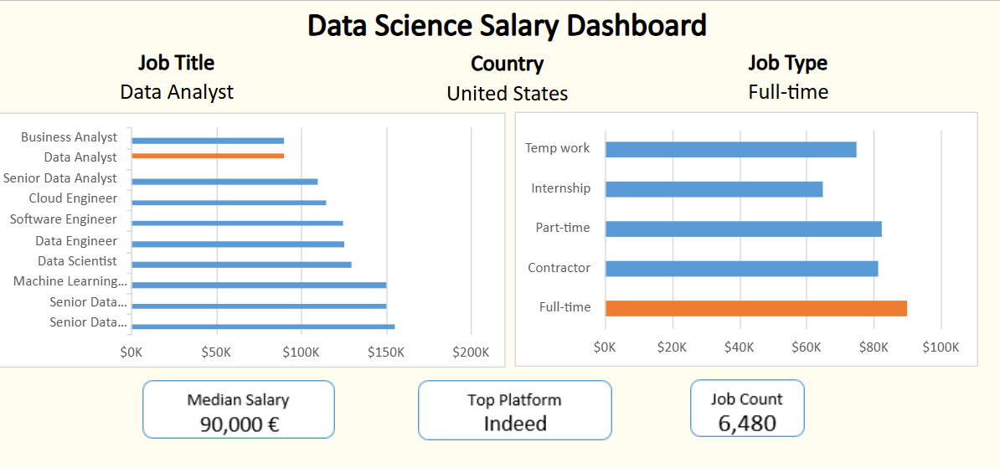

# 📊 Excel Projects

### Welcome to my Excel Projects repository!
This repo contains a collection of my work with Microsoft Excel, focusing on data analysis, visualization, automation, and reporting. Each project demonstrates different Excel skills such as **Formulas**, **Pivot Tables**, **Charts**, **Dashboard** , **Power Query** and **Power Pivot**.

### Projects Included
- Data Science Job Dashboard : A dynamic dashboard with KPIs, trend analysis, and slicers for filtering.

### Skills Demonstrated
- Advanced Excel formulas (VLOOKUP, INDEX-MATCH, IF, etc.)
- Data cleaning & preprocessing
- Pivot Tables & Pivot Charts
- Interactive Dashboards (Slicers, Timelines, Conditional Formatting)
- Power Query for ETL (Extract, Transform, Load)

### How to Use
- Clone this repository 🠲 https://github.com/asiftm/Excel-Projects.git
- Open in Microsoft Excel (or Excel Online) 🠲 [OneDrive](https://1drv.ms/x/c/5afa1d7f43683360/IQSWg_hCLtZNT4JEG0PeiawlAT_F3VRsfMiM7iq2IDYqZW8)

### Screenshots

